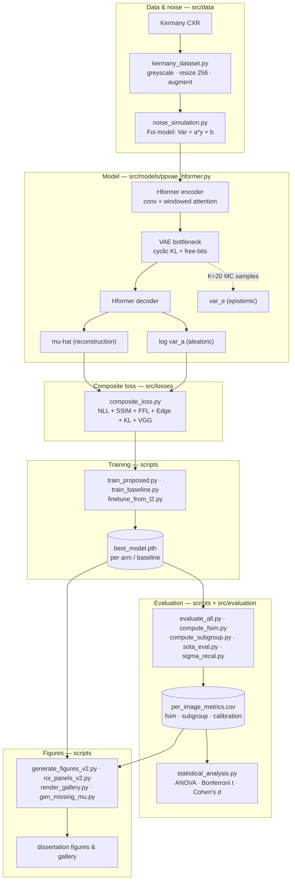

# PP-VAE-Hformer: Pathology-Preserving Variational Autoencoder for Paediatric Chest X-Ray Denoising

**MPhil Dissertation — University of Cambridge**
**Samuel Tekle | Department of Primary Care and Public Health — MRC Biostatistics Unit**

---

## Overview

This repository contains the full research artefacts for an MPhil dissertation on **low-dose paediatric chest X-ray (CXR) denoising with calibrated per-pixel uncertainty**. The central contribution is **PP-VAE-Hformer**: a hybrid CNN–Transformer (Hformer) encoder–decoder with an optional Variational Autoencoder (VAE) bottleneck, trained with a composite **NLL + SSIM + FFL + KL** objective. It denoises the image while predicting both *aleatoric* (noise-inherent) and *epistemic* (model) uncertainty at every pixel.

The motivation: standard deep denoisers (DnCNN, FFDNet, DRUNet) optimise PSNR/SSIM, which rewards smooth reconstructions and erases clinically critical fine structure — vascular markings, consolidation margins, costophrenic angles. Replacing the pixel loss with a **heteroscedastic negative log-likelihood** buys a calibrated "how much to trust this pixel" map, and a two-stage fine-tuning step recovers the small fidelity cost that head otherwise incurs.

The study is a **19-arm loss/architecture ablation (A–S)** benchmarked against **8 retrained baselines** on the [Kermany et al. (2018)](https://www.kaggle.com/datasets/paultimothymooney/chest-xray-pneumonia) paediatric CXR dataset, evaluated on a fixed 624-image held-out test set under a physically grounded Poisson–Gaussian (Foi) noise model at three dose levels.

---

## Headline results (mid noise η = 200, n = 624; see dissertation Table 4.2)

| Model | Loss / type | PSNR (dB) ↑ | Note |
|-------|-------------|-------------|------|
| **A** | L2 | **34.618** | PSNR ceiling; smoothest, loses vessel detail |
| **S** | NLL+SSIM+FFL (fine-tuned from A) | 34.608 | Calibrated uncertainty at ~no PSNR cost |
| **R** | L1+SSIM+FFL (fine-tuned from J) | 34.545 | **Best perceptual: LPIPS 0.2192, FSIM 0.9332** |
| **Q** | Charbonnier | 34.535 | Pixel-norm equivalent to A/I |
| SCUNet | retrained SOTA baseline | 34.149 | Strongest baseline (57 M params) |
| NAFNet | retrained SOTA baseline | 33.803 | 116 M params |
| SharpXR | retrained paediatric-CXR baseline | 33.561 | |
| **D** | NLL+SSIM+FFL (single-stage) | 33.435 | Best single-stage uncertainty arm |
| **H** | VAE (cyclic KL + free-bits) | 32.762 | Best VAE arm; adds epistemic map |
| **O** | NLL+SSIM+FFL with PReLU | 29.074 | Catastrophic failure (design lesson) |

**Key finding:** the calibrated uncertainty map is obtained at effectively no cost to reconstruction quality — the NLL head's ~1.2 dB PSNR price (Arm B vs A) is recovered to a statistically indistinguishable 0.010 dB by two-stage fine-tuning (Arm S). The perception–distortion trade-off is resolved in the perceptual direction by Arm R.

> LPIPS is reported on the `piq` scale throughout (lower is better). Do **not** cross it with the `per_image_metrics.csv` LPIPS column, which is on a different scale.

---

## Architecture

```
Input (noisy CXR) ─▶ Hformer Encoder ─▶ [VAE bottleneck] ─▶ Hformer Decoder ─┬─▶ μ̂          (reconstruction)
                     (conv + windowed      z ~ q(z|x)        (skip conns)     └─▶ log σ̂²_a   (aleatoric uncertainty)
                      self-attention)                                          
                     Monte-Carlo latent sampling (K=20) ──────────────────────▶ σ̂²_e        (epistemic uncertainty)
```

- **Backbone**: hybrid convolution + lightweight windowed self-attention (Hformer), ~24.9 M params (25.7 M with the VAE bottleneck).
- **VAE bottleneck**: reparameterised latent `z` with KL regularisation; cyclical annealing + free-bits prevent posterior collapse.
- **Dual head**: reconstruction `μ̂` and aleatoric log-variance `log σ̂²_a`; epistemic `σ̂²_e` from K=20 MC latent samples.

---

## Repository structure

```
pp-vae-hformer/  (branch: code)
├── README.md                    ← this file
├── dissertation/                ← LaTeX source (synced with Overleaf) + figures + References.bib
├── results/                     ← evaluation CSVs (metrics only; no model weights)
│   ├── per_image_metrics.csv    ← per-image PSNR/SSIM/LPIPS/NLL/FSIM, all conditions × 3 noise levels
│   ├── metrics_summary.csv  pairwise_stats_metrics.csv  subgroup_metrics.csv  per_image_fsim.csv
└── code/
    ├── requirements.txt
    ├── src/
    │   ├── models/      ← ppvae_hformer.py (architecture), config.py
    │   ├── losses/      ← composite_loss.py + nll/ms_ssim/focal_frequency/edge/kl/perceptual
    │   ├── data/        ← kermany_dataset.py, noise_simulation.py (Foi model)
    │   ├── training/    ← config.py (ABLATION_ARMS registry — the single source of truth for arms)
    │   └── evaluation/  ← metrics.py
    ├── scripts/         ← training / evaluation / figure-generation entry points (see run order below)
    └── slurm/           ← CSD3 (Cambridge HPC) SLURM job scripts, one per pipeline stage
```

The **arm registry** `code/src/training/config.py::ABLATION_ARMS` defines every arm (loss terms, KL schedule, activation) and is the authoritative list; all scripts read arm configs from it.

---

## Codebase flow

How the modules connect, from raw image to dissertation figure. Each stage maps to a SLURM job in [`code/slurm/`](code/slurm/README.md).



The **arm** is the single control variable: `train_proposed.py --arm <name>` looks up `ABLATION_ARMS[<name>]`, which switches on/off the loss terms in `composite_loss.py` and the VAE/activation flags in the model — so every arm shares one code path and differs only in configuration.

---

## Noise model (Foi Poisson–Gaussian)

Applied to the normalised displayed intensity `y ∈ [0,1]`:

```
Var(ỹ | y) = a·y + b        # ỹ = noisy pixel, y = clean pixel
```

Three presets (`a`, `b`) give low / mid / high dose; mid is `a = 0.03, b = 0.005` (σ_eff ≈ 0.122 at ȳ = 0.5). Noise is regenerated per image per epoch during training; validation/test use fixed per-image seeds. See `code/src/data/noise_simulation.py`.

---

## Setup

```bash
# 1. Python environment (CUDA 12.1, tested on NVIDIA A100)
conda create -n ppvae python=3.12 -y && conda activate ppvae
pip install -r code/requirements.txt

# 2. Data — Kermany paediatric CXR (Normal + Bacterial/Viral Pneumonia)
#    Download from Kaggle and lay out as:
#      chest_xray/{train,test}/{NORMAL,PNEUMONIA}/*.jpeg
#    (BACTERIA*/VIRUS* filename prefixes distinguish the two pneumonia classes;
#     the 785-image validation split is carved from train/ programmatically, seed 42.)
export DATA=/path/to/chest_xray
export RESULTS=/path/to/ppvae_results       # trained weights + evaluation outputs land here
```

On **CSD3** the paths are `DATA=/rds/user/stm43/hpc-work/chest_xray`, `RESULTS=/rds/user/stm43/hpc-work/ppvae_results`, account `mrc-bsu2-sl2-gpu`, partition `ampere`, and the SLURM scripts load `module load rhel8/default-amp cuda/12.1; conda activate ppvae`.

---

## Reproduction — what to run, in order

Each stage depends only on the outputs of the previous ones. **Local** commands run one item at a time; the **HPC** column submits the whole stage as a SLURM array/job. A single arm trains in ≈45 min on 4×A100.

### 1 · Train the 19 ablation arms (A–S)

```bash
# Local (single arm, or "all" / "new"):
python code/scripts/train_proposed.py --arm arm_d_nll_ssim_ffl --data_dir $DATA --output_dir $RESULTS
python code/scripts/train_proposed.py --arm all               --data_dir $DATA --output_dir $RESULTS
# HPC (all 16 core arms A–P as a job array; see comments in the script for subsets):
sbatch code/slurm/array_all_arms.sh
sbatch code/slurm/train_arm_q_charb.sh          # Arm Q (Charbonnier), trained from scratch
```
Arm N downloads VGG-16 weights on first run — pre-cache with `python code/scripts/prefetch_vgg.py` if compute nodes lack internet. Each arm writes `$RESULTS/<arm>/best_model.pth`.

### 2 · Two-stage fine-tuning (Arms R, S — depend on Arm A being trained)

```bash
python code/scripts/finetune_from_l2.py --arm arm_r_ft_j --ft_lr 5e-5 --ft_epochs 100
python code/scripts/finetune_from_l2.py --arm arm_s_ft_d --ft_lr 2e-5 --ft_epochs 100 --blend_epochs 20
# HPC:  sbatch code/slurm/finetune_r.sh ;  sbatch code/slurm/finetune_s.sh
```

### 3 · Train the 8 retrained baselines

```bash
sbatch code/slurm/array_baselines.sh            # KAIR: DnCNN, IRCNN, FFDNet, DRUNet, SwinIR
# NAFNet / SCUNet trained via BasicSR; SharpXR via its baseline class. Weights land in $RESULTS/baselines/<name>/.
python code/scripts/download_baseline_weights.py   # (optional) fetch original pretrained weights for reference
```

### 4 · Evaluate on the held-out test set

```bash
python code/scripts/evaluate_all.py --data_dir $DATA --results_dir $RESULTS \
       --output_dir $RESULTS/evaluation          # → per_image_metrics.csv (PSNR/SSIM/NLL)
python code/scripts/compute_fsim.py              # → held-out FSIM + LPIPS (piq)
python code/scripts/compute_subgroup_metrics.py  # → Normal / Bacterial / Viral subgroup metrics
python code/scripts/eval_baselines.py            # → the 8 retrained baselines on the same unified pass
# HPC:  sbatch code/slurm/evaluate_all.sh ;  sbatch code/slurm/compute_fsim.sh ;  sbatch code/slurm/compute_subgroup.sh
```

### 5 · Statistics

```bash
python code/scripts/statistical_analysis.py      # ANOVA, Bonferroni pairwise t-tests, Cohen's d, bootstrap CIs
```

### 6 · Figures (reproduce the dissertation panels)

```bash
python code/scripts/generate_figures_v2.py       # ablation facets, dose curves, per-arm qualitative panels, latent UMAP
python code/scripts/generate_roi_panels_v2.py    # region-of-interest comparison grids
python code/scripts/gen_missing_mu.py            # μ̂ for Q/R/S + NAFNet/SCUNet/SharpXR on the shared gallery case
python code/scripts/render_gallery.py            # appendix reconstruction gallery (all 27 conditions)
# HPC:  sbatch code/slurm/gen_figures_v2.sh ;  sbatch code/slurm/roi_panels.sh
```

**Quick check:** `python code/scripts/smoke_test.py` runs a fast forward/backward pass to confirm the environment and model build before launching full training.

---

## Dependencies

Training/evaluation core (`code/requirements.txt`): `torch>=2.0` (CUDA 12.1), `torchvision`, `Pillow`, `numpy`, `piq>=0.8` (FSIM/LPIPS), `lpips`, `tqdm`. The analysis and figure scripts additionally use `scipy`, `matplotlib`, `scikit-learn` (latent ARI), `umap-learn` (UMAP), `bm3d` (classical baseline), and `optuna` (loss-weight sweep); inferential statistics/figures use R 4.6 (`ggstatsplot`, `Durga`, `dabestr`). Install these alongside the pinned core when running stages 5–6.

---

## Status

| Component | Status |
|-----------|--------|
| 19-arm ablation (A–S) | ✅ Complete |
| 8 retrained baselines (5 KAIR + NAFNet/SCUNet/SharpXR) | ✅ Complete |
| Evaluation (PSNR/SSIM/NLL/FSIM/LPIPS, 3 noise levels) | ✅ Complete |
| Calibration + latent-space analysis | ✅ Complete |
| Dissertation | ✅ Complete (submission draft) |

---

## Citation

```
Tekle, S. (2026). Low-Dose Paediatric Chest X-Ray Denoising with Calibrated
Per-Pixel Uncertainty (PP-VAE-Hformer). MPhil Dissertation, University of Cambridge.
```
